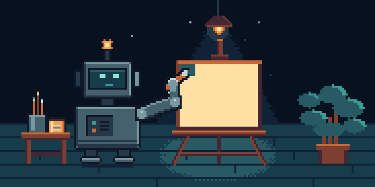
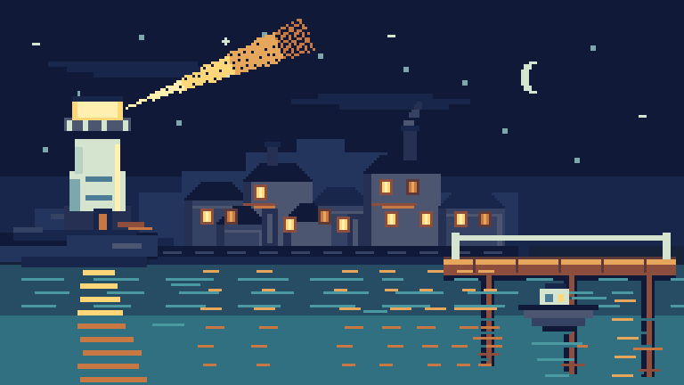

<div align="center">



# Aseprite AI Artist

**Let a coding agent draw pixel art in your open Aseprite window** — not in a
copy, not on disk, in the document you are looking at.

[](https://www.npmjs.com/package/@pebbly/aseprite-ai-artist)
[](https://github.com/with-pebbly/aseprite-ai-artist/actions/workflows/ci.yml)
[](LICENSE)

*192×96, 36 frames, one palette, drawn through this server into a live Aseprite
window. The brush tip is where the paint appears, every frame: the sky goes on
in passes, then the sun, then the hills, then a signature in the corner — and
once the sun is lit it warms the frame, the floor and the robot that painted it.*

</div>

---

One MCP server, one Aseprite extension, and a pixel-art rulebook the agent
actually has to follow. Works with **Claude Code, Codex CLI, Gemini CLI, Cursor,
VS Code and Windsurf** from the same one-line config.

> *"Draw me a 32×32 knight in the PICO-8 palette, then a 4-frame idle."*

The agent inspects the document, picks a palette, blocks in a silhouette,
**looks at what it drew**, shades with proper hue shifting, rigs the character
onto layers, animates, tags the cycle, validates, and tells you what it
compromised on. In your window, undoable, one Ctrl+Z per edit.

---

## Install

**Requires [Aseprite](https://www.aseprite.org/) 1.3 or newer and Node 22.6+.**
Aseprite must have been run at least once, so that its config directory exists.

### Step 1 — install the Aseprite extension

```bash
npx @pebbly/aseprite-ai-artist install-extension
```

Then **quit and reopen Aseprite**. The extension only dials out at startup, so
an editor left running from before the install will never connect.

### Step 2 — wire up your agent

<details open>
<summary><b>Claude Code</b> — install the plugin, not the bare server</summary>

<br>

```
/plugin marketplace add with-pebbly/aseprite-ai-artist
/plugin install aseprite-ai-artist
```

The plugin carries its own MCP server plus the `/pixel-*` skills, the specialist
subagents and the preview hooks. **Do not also add the server by hand** — you
would load the same eighteen tools twice, on every request.

</details>

<details>
<summary><b>Codex CLI, Gemini CLI, Cursor, VS Code, Windsurf</b></summary>

<br>

```bash
npx @pebbly/aseprite-ai-artist install codex      # ~/.codex/config.toml
npx @pebbly/aseprite-ai-artist install gemini     # ~/.gemini/settings.json
npx @pebbly/aseprite-ai-artist install cursor     # ~/.cursor/mcp.json
npx @pebbly/aseprite-ai-artist install --all      # every client above
```

Existing config is backed up first. `--dry-run` shows the change without making
it; `--project` writes into the repository instead of your home directory;
`--agents` also appends a section to your `AGENTS.md`.

</details>

Then **restart the agent** so it picks up the new server.

### Step 3 — check it

```bash
npx @pebbly/aseprite-ai-artist doctor
```

Ticks all the way down and you are ready. If a line is not a tick, it names
which half is missing instead of making you guess.

Per-client detail and troubleshooting: **[docs/INSTALL.md](docs/INSTALL.md)**.

---

## Which agent should do the drawing?

Two separate things matter, and they do not point at the same client.

**Integration** — how much of the craft a client can actually receive:

| Client | Tools | `rules://` + `skill://` | MCP prompts | Slash commands, subagents, hooks |
|---|:--:|:--:|:--:|:--:|
| Claude Code | ✅ | ✅ | ✅ | ✅ via the plugin |
| Codex CLI | ✅ | ✅ | ✖ | — |
| Gemini CLI, Cursor, VS Code, Windsurf | ✅ | ✅ | varies | — |

The two right-hand columns are about *delivery*, not content. Every client gets
the same rulebook and the same eleven workflows through `rules://` and
`skill://` — a client without prompts reads the identical markdown, it just has
to fetch it rather than being handed a menu of `/pixel-*` commands. What Claude
Code alone gets is the ergonomics and one thing of real substance: the hook that
nudges the agent to **look** at what it just drew, and the specialist subagents,
including a critic that reviews with its own fresh context. Elsewhere that
critique has to come from you — which is exactly how the harbour at the foot of
this page was made: Codex drew, a reviewer picked it apart, five times.

**Drawing ability** — this is not a benchmark. It is a log of what actually drew
the art on this page, kept honest: every row is a model we watched work on a
real brief through this server, and models we have not run are listed as such
rather than guessed at.

| Model (as we ran it) | What it drew here | How it went |
|---|---|---|
| **Claude Fable 5.1**<br>`claude --model fable` | the hero animation at the top | **Best result so far.** One session, ~80 min, no review passes from us. Rebuilt the scene on eight layers and solved the arm by inverse kinematics from the brush tip, which is why the brush touches the canvas in all 36 frames. |
| **Codex CLI, `gpt-5.6-terra`**<br>`model_reasoning_effort = "high"` | the harbour at the foot of this page, and the mascot | Strong, but it took five review passes: the pier read as fallen scaffolding, the beam lay across the roofs like a bar, windows sat on the wrong houses. |
| **Claude Opus 5** | this server, the rulebook, the briefs and every review pass | The planner and the critic, not the illustrator. Its own attempt at the hero was scrapped and redrawn by Fable. Palette work, rig layout, animation timing and catching another model's mistakes are where it earns its place. |
| Gemini 3 Pro, Claude Sonnet 5, Cursor, everything else | — | **Not tested.** If you run one against a real brief, a PR with the sprite is welcome. |

<div align="center">
<br>
<sub><i>the mascot, Codex CLI, from the brief and the rulebook alone</i></sub>
</div>

**What actually made the difference was method, not model.** Both good results
came the same way, and it is a technique you can hand to any client:

- **Generate, don't hand-place.** The two scenes that worked were written as a
  small program that emits every frame — a coordinate model, a palette, a
  schedule of what appears when — and only then pushed through `draw`. Placing
  pixels one call at a time by eye is where the weaker attempts died.
- **Look at full-size frames, one at a time.** A filmstrip is a trap: at that
  size you see what you know is meant to be there. Every defect we shipped and
  had to fix was invisible in the strip and obvious at 1:1.
- **Turn reasoning up before you blame the model.** A 32×32 grid is a spatial
  problem — hold a coordinate frame, keep a silhouette readable, notice when a
  shape has gone wrong.
- **Split the roles if you have two clients.** Brief and review in Claude Code
  with `pixel-brief` and `pixel-review`, execute the drawing passes in whichever
  model draws best. They talk to the same live document through the same bridge,
  so they can take turns on one sprite.

The rulebook narrows the gap a long way — an agent that never reads a word of it
still cannot casually widen your palette, because `draw` and `recolor` snap by
perceptual distance and report every colour they moved. It does not close it.

---

## What makes it different

**It works everywhere, not just in Claude Code.** Most Aseprite MCP projects put
their craft knowledge in a Claude Code plugin. Codex, Gemini and Cursor then get
raw tools and none of the discipline — which is most of what separates a sprite
from coloured noise. Here the rules and workflows are served over MCP as
`rules://` and `skill://` resources *and* as MCP prompts, so every client gets
them from one source of truth.

**Eighteen tools, not ninety.** Every tool schema sits in the model's context on
every turn, whether or not you are drawing. Grouping by noun with an `op` enum,
plus batch arrays, covers the same ground at roughly a sixth of the cost — and
makes batching the default, so one `draw` call is one undo step for you.

**One config line on every OS.** No compiled binary, no per-platform path, no
native dependencies. `npx` and go.

**It has to look at its own work.** `look` gives the agent an upscaled preview,
an exact one-glyph-per-pixel text grid, a filmstrip of every animation frame,
and a pixel-level diff between frames. `validate` then checks the sprite
mechanically before anything gets called finished.

**It cannot quietly wreck your file.** When Aseprite is not attached, every tool
refuses immediately with `doNotFallBackToDisk` rather than timing out — because
an agent that "recovers" by editing the `.aseprite` file makes changes you never
see, and your next save overwrites them.

There is [a whole page](docs/RESEARCH.md) on the other projects in this space,
what was taken from them, and where they are still better.

---

## The tools

Eighteen, grouped by noun. Full reference in **[docs/TOOLS.md](docs/TOOLS.md)**.

| | |
|---|---|
| **Session** | `preflight` · `sprite_info` · `sprite_manage` |
| **Looking** | `look` · `read_pixels` |
| **Drawing** | `draw` · `select` · `transform` · `recolor` |
| **Structure** | `layer` · `frame` · `tag` · `cel` |
| **Colour & quality** | `palette` · `validate` |
| **Assets** | `reference` · `export` · `tileset` |

Plus `run_lua` as an escape hatch, off by default.

## The skills

Workflows the agent follows, served to every client:

`pixel-brief` · `pixel-new` · `pixel-palette` · `pixel-draw` · `pixel-shade` ·
`pixel-rig` · `pixel-animate` · `pixel-tileset` · `pixel-review` · `pixel-fix` ·
`pixel-export`

And in Claude Code, four specialist subagents: **pixel-critic** (visual QA),
**palette-smith** (colour), **rig-builder** (layer rigs), **animation-director**
(cycle planning).

## The rules

The craft is encoded in [`rules/`](rules/) and served as `rules://` resources —
palette discipline, hue-shifted shading, silhouette and proportion, outlines and
edges, animation timing, layer rigging, and a review checklist. Skills reference
rules rather than restating them, so a rule has exactly one place to be wrong.

---

## How it works

```
your agent  ──stdio/MCP──▶  server  ──ws:9932──▶  bridge  ──ws:9931──▶  Aseprite
```

Aseprite's Lua WebSocket is a client only, so the bridge holds the listening
socket. It runs as its own singleton process so that restarting the MCP server —
which agent hosts do freely — does not drop your Aseprite connection, and so a
second agent window can attach without stealing the first one's replies.

Details in **[docs/ARCHITECTURE.md](docs/ARCHITECTURE.md)** and the
[ADRs](docs/adr/).

## Development

```bash
npm install
npm run build
npm test                 # TypeScript: colour, render, bridge, MCP surface, CLI
npm run test:pure        # Lua that needs no editor — also what CI runs
npm run test:extension   # Lua handlers, headless, against a real sprite
```

`test:extension` runs the real command handlers inside `aseprite -b` against a
real sprite — the only way to prove that half works without a human clicking.
It needs Aseprite installed, so CI cannot run it; `test:pure` is the part that
runs anywhere.

## Security

The bridge binds `127.0.0.1` only, on both ports. There is no remote surface and
no authentication, because there is nothing remote to authenticate. `run_lua` is
arbitrary code execution inside the app holding your unsaved work, and is off
unless you turn it on. Full threat model in [SECURITY.md](SECURITY.md).

## One more, drawn the same way

<div align="center">



*256×144, 28 frames, ten layers, exported at 3×. The scene is painted once and
only six layers move — the beam, the windows, the water, the smoke, the boat and
the stars — each on its own cycle length, which is what stops an ambient loop
feeling mechanical. It took five review passes: the pier read as fallen
scaffolding, the beam was a hard bar lying across the roofs instead of light,
windows sat on houses that were not theirs, reflections fell where nothing cast
them, and the whole loop ran twice too fast.*

</div>

## Licence

MIT. See [LICENSE](LICENSE).

Aseprite is a trademark of Igara Studio S.A. This project is not affiliated with
or endorsed by them.
