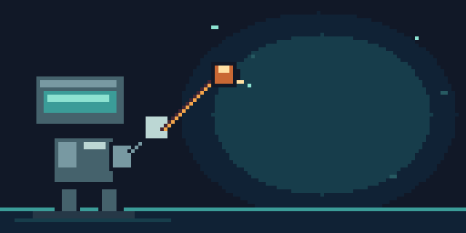
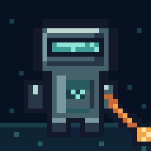

<div align="center">



# Aseprite AI Artist

**Let a coding agent draw pixel art in your open Aseprite window** — not in a
copy, not on disk, in the document you are looking at.

[](https://www.npmjs.com/package/@pebbly/aseprite-ai-artist)
[](https://github.com/with-pebbly/aseprite-ai-artist/actions/workflows/ci.yml)
[](LICENSE)

*Forty frames, one 16-colour palette, drawn by Codex through this server in a
live Aseprite window — silhouette, flats, hue-shifted shading, then the lights
come on. Nobody touched a pixel by hand.*

</div>

---

One MCP server, one Aseprite extension, and a pixel-art rulebook the agent
actually has to follow. Works with **Claude Code, Codex CLI, Gemini CLI, Cursor,
VS Code and Windsurf** from the same one-line config.

> *"Draw me a 32×32 knight in the PICO-8 palette, then a 4-frame idle."*

The agent inspects the document, picks a palette, blocks in a silhouette,
**looks at what it drew**, shades with proper hue shifting, rigs the character
onto layers, animates, tags the cycle, validates, and tells you what it
compromised on. In your window, undoable, one Ctrl+Z per edit.

---

## Install

**Requires [Aseprite](https://www.aseprite.org/) 1.3 or newer and Node 22.6+.**
Aseprite must have been run at least once, so that its config directory exists.

### Step 1 — install the Aseprite extension

```bash
npx @pebbly/aseprite-ai-artist install-extension
```

Then **quit and reopen Aseprite**. The extension only dials out at startup, so
an editor left running from before the install will never connect.

### Step 2 — wire up your agent

<details open>
<summary><b>Claude Code</b> — install the plugin, not the bare server</summary>

<br>

```
/plugin marketplace add with-pebbly/aseprite-ai-artist
/plugin install aseprite-ai-artist
```

The plugin carries its own MCP server plus the `/pixel-*` skills, the specialist
subagents and the preview hooks. **Do not also add the server by hand** — you
would load the same eighteen tools twice, on every request.

</details>

<details>
<summary><b>Codex CLI, Gemini CLI, Cursor, VS Code, Windsurf</b></summary>

<br>

```bash
npx @pebbly/aseprite-ai-artist install codex      # ~/.codex/config.toml
npx @pebbly/aseprite-ai-artist install gemini     # ~/.gemini/settings.json
npx @pebbly/aseprite-ai-artist install cursor     # ~/.cursor/mcp.json
npx @pebbly/aseprite-ai-artist install --all      # every client above
```

Existing config is backed up first. `--dry-run` shows the change without making
it; `--project` writes into the repository instead of your home directory;
`--agents` also appends a section to your `AGENTS.md`.

</details>

Then **restart the agent** so it picks up the new server.

### Step 3 — check it

```bash
npx @pebbly/aseprite-ai-artist doctor
```

Ticks all the way down and you are ready. If a line is not a tick, it names
which half is missing instead of making you guess.

Per-client detail and troubleshooting: **[docs/INSTALL.md](docs/INSTALL.md)**.

---

## Which agent should do the drawing?

Two separate things matter, and they do not point at the same client.

**Integration** — how much of the craft a client can actually receive:

| Client | Tools | `rules://` + `skill://` | MCP prompts | Slash commands, subagents, hooks |
|---|:--:|:--:|:--:|:--:|
| Claude Code | ✅ | ✅ | ✅ | ✅ via the plugin |
| Codex CLI | ✅ | ✅ | ✖ | — |
| Gemini CLI, Cursor, VS Code, Windsurf | ✅ | ✅ | varies | — |

**Drawing ability** — hands-on impression rather than a benchmark, and the part
that surprises people:

- **Reasoning effort matters more than you would expect.** Placing pixels on a
  32×32 grid is a spatial problem: the model has to hold a coordinate frame in
  its head, keep a silhouette readable at that size, and notice when a shape has
  gone wrong. Turn reasoning up before you blame the tool.
- **Codex CLI on a high-reasoning setting is the best drawer we have used** — it
  drew the animation at the top of this page and the mascot below, working from
  a brief and the rulebook alone.

  

- **Claude Code is the better planner and critic.** Palette construction, rig
  layout, animation timing and the review pass come out noticeably stronger;
  raw pixel placement at small canvas sizes is weaker.
- If you have both, split the work: brief and review in Claude Code with
  `pixel-brief` and `pixel-review`, execute the drawing passes in Codex. They
  talk to the same live document through the same bridge, so they can take turns
  on one sprite.

The rulebook narrows the gap a long way — an agent that never reads a word of it
still cannot casually widen your palette, because `draw` and `recolor` snap by
perceptual distance and report every colour they moved. It does not close it.

---

## What makes it different

**It works everywhere, not just in Claude Code.** Most Aseprite MCP projects put
their craft knowledge in a Claude Code plugin. Codex, Gemini and Cursor then get
raw tools and none of the discipline — which is most of what separates a sprite
from coloured noise. Here the rules and workflows are served over MCP as
`rules://` and `skill://` resources *and* as MCP prompts, so every client gets
them from one source of truth.

**Eighteen tools, not ninety.** Every tool schema sits in the model's context on
every turn, whether or not you are drawing. Grouping by noun with an `op` enum,
plus batch arrays, covers the same ground at roughly a sixth of the cost — and
makes batching the default, so one `draw` call is one undo step for you.

**One config line on every OS.** No compiled binary, no per-platform path, no
native dependencies. `npx` and go.

**It has to look at its own work.** `look` gives the agent an upscaled preview,
an exact one-glyph-per-pixel text grid, a filmstrip of every animation frame,
and a pixel-level diff between frames. `validate` then checks the sprite
mechanically before anything gets called finished.

**It cannot quietly wreck your file.** When Aseprite is not attached, every tool
refuses immediately with `doNotFallBackToDisk` rather than timing out — because
an agent that "recovers" by editing the `.aseprite` file makes changes you never
see, and your next save overwrites them.

There is [a whole page](docs/RESEARCH.md) on the other projects in this space,
what was taken from them, and where they are still better.

---

## The tools

Eighteen, grouped by noun. Full reference in **[docs/TOOLS.md](docs/TOOLS.md)**.

| | |
|---|---|
| **Session** | `preflight` · `sprite_info` · `sprite_manage` |
| **Looking** | `look` · `read_pixels` |
| **Drawing** | `draw` · `select` · `transform` · `recolor` |
| **Structure** | `layer` · `frame` · `tag` · `cel` |
| **Colour & quality** | `palette` · `validate` |
| **Assets** | `reference` · `export` · `tileset` |

Plus `run_lua` as an escape hatch, off by default.

## The skills

Workflows the agent follows, served to every client:

`pixel-brief` · `pixel-new` · `pixel-palette` · `pixel-draw` · `pixel-shade` ·
`pixel-rig` · `pixel-animate` · `pixel-tileset` · `pixel-review` · `pixel-fix` ·
`pixel-export`

And in Claude Code, four specialist subagents: **pixel-critic** (visual QA),
**palette-smith** (colour), **rig-builder** (layer rigs), **animation-director**
(cycle planning).

## The rules

The craft is encoded in [`rules/`](rules/) and served as `rules://` resources —
palette discipline, hue-shifted shading, silhouette and proportion, outlines and
edges, animation timing, layer rigging, and a review checklist. Skills reference
rules rather than restating them, so a rule has exactly one place to be wrong.

---

## How it works

```
your agent  ──stdio/MCP──▶  server  ──ws:9932──▶  bridge  ──ws:9931──▶  Aseprite
```

Aseprite's Lua WebSocket is a client only, so the bridge holds the listening
socket. It runs as its own singleton process so that restarting the MCP server —
which agent hosts do freely — does not drop your Aseprite connection, and so a
second agent window can attach without stealing the first one's replies.

Details in **[docs/ARCHITECTURE.md](docs/ARCHITECTURE.md)** and the
[ADRs](docs/adr/).

## Development

```bash
npm install
npm run build
npm test                 # TypeScript: colour, render, bridge, MCP surface, CLI
npm run test:pure        # Lua that needs no editor — also what CI runs
npm run test:extension   # Lua handlers, headless, against a real sprite
```

`test:extension` runs the real command handlers inside `aseprite -b` against a
real sprite — the only way to prove that half works without a human clicking.
It needs Aseprite installed, so CI cannot run it; `test:pure` is the part that
runs anywhere.

## Security

The bridge binds `127.0.0.1` only, on both ports. There is no remote surface and
no authentication, because there is nothing remote to authenticate. `run_lua` is
arbitrary code execution inside the app holding your unsaved work, and is off
unless you turn it on. Full threat model in [SECURITY.md](SECURITY.md).

## Licence

MIT. See [LICENSE](LICENSE).

Aseprite is a trademark of Igara Studio S.A. This project is not affiliated with
or endorsed by them.
